---
title: Windows Service Installation
---

This guide explains how to install a TestBench service as a Windows service using [Servy](#option-1-servy-recommended), [NSSM](#option-2-nssm), [FireDaemon](#option-3-firedaemon), [YAJSW](#option-4-yajsw-yet-another-java-service-wrapper), or the built-in [Windows Task Scheduler](#autostart-with-windows-task-scheduler-alternative).

:::tip[Service-specific values]
Each service's documentation provides the concrete values to substitute for `<serviceName>`, `<serviceDisplayName>`, `<serviceExecutable>`, `<servicePort>`, and `<serviceInstallDir>` used in the examples below.
:::

---

## Requirements

- **Installed service**: Either the ready-to-use executable (recommended, no Python needed) or a pip install with a `.venv` — see the service's Installation guide
- **Administrator Privileges**: Required for installing and managing Windows services
- **Port Availability**: Ensure the desired port is not in use by another application

:::note[Executable path vs. Python venv path]
The examples throughout this guide use a Python virtual environment path such as `.venv\Scripts\<serviceExecutable>`.
If you installed using the **ready-to-use executable**, replace this with the direct path to the extracted executable instead, e.g., `<serviceInstallDir>\<serviceExecutable>`. No `.venv` folder is involved.
:::

---

## Which Option to Choose?

| Feature | Servy | NSSM | FireDaemon | YAJSW |
|---------|-------|------|------------|-------|
| **License** | Free (MIT License) | Free (Public Domain) | Commercial | Free (Apache License) |
| **GUI** | Yes | Yes | Yes | No |
| **CLI / scriptable** | Yes (CLI + PowerShell module) | Yes | Yes | Yes |
| **Requirements** | None | None | None | Java Runtime |
| **Complexity** | Low | Low | Low | Medium |
| **Best For** | Most users — GUI *and* scripted rollouts | Minimal, long-established free wrapper | Enterprise GUI management | Java environments, cross-platform |

### Recommendations

- **Servy**: **Recommended for most users** — free (MIT), Windows-native, and the only option here that offers a GUI, a CLI and a PowerShell module for the same configuration, so a setup can be clicked once and scripted afterwards. Adds log rotation, health checks, service dependencies and start/stop hooks out of the box
- **NSSM**: Choose if you prefer a minimal, long-established wrapper with a large body of third-party documentation
- **FireDaemon**: Choose if you have budget for commercial software and prefer comprehensive GUI-based management with advanced features
- **YAJSW**: Choose if you already have Java installed or need cross-platform compatibility (also supports Linux/macOS)

---

## Option 1: Servy *(Recommended)*

Servy is a Windows-native process wrapper (MIT licensed) that offers a GUI, a CLI
(`servy-cli.exe`) and a PowerShell module for the same configuration.

:::caution[Administrator privileges are mandatory]
Servy needs elevation for **every** operation — the GUI as well as *every* `servy-cli`
subcommand, including `--help` and `status`. Servy reads and writes its own database and key
material below `C:\ProgramData\Servy`. Without elevation you get
`Access to the path 'C:\ProgramData\Servy\security\aes_key.dat' is denied.`
:::

### Installation

Configure the service using one of the following methods:

### Method 1: GUI Configuration

1. Start `Servy.exe` **as Administrator**.

2. Configure the following in the **Main** tab:
   - Service Name: `<serviceName>`
   - Display Name: `<serviceDisplayName>`
   - Service Description: `Python-based <serviceDisplayName>`
   - Process Path: Path to the service executable
     e.g., `<serviceInstallDir>\.venv\Scripts\<serviceExecutable>`
   - Startup Directory: Path to the root directory containing configuration files
     e.g., `<serviceInstallDir>\`
   - Process Parameters: Startup parameters
     e.g., `start --port <servicePort>`
   - Startup Type: `Automatic (delayed start)`
   - Process Priority: `Normal (default)`
   - Start Timeout: `10` (seconds)
   - Stop Timeout: `5` (seconds)
   - Enable Console UI: leave **unchecked**

   

   :::warning[Enable Console UI disables logging]
   "Enable Console UI" and stdout/stderr redirection are mutually exclusive. Leave the
   checkbox unchecked, otherwise the log files configured in the **Logging** tab stay empty.
   :::

3. Configure the following in the **Logging** tab:
   - Stdout: Path to the log file for stdout output,
     e.g., `<serviceInstallDir>\logs\stdout.log`
   - Stderr: Path to the log file for stderr output,
     e.g., `<serviceInstallDir>\logs\stderr.log`
   - Optionally enable size- or date-based log rotation.

4. **Optional:** In the **Recovery** tab, configure what happens when the process exits
   unexpectedly — recovery actions, health checks and notifications.

5. **Optional:** In the **Advanced** tab, set environment variables (`VAR=value`, one per
   line or separated by semicolons) and Windows service dependencies. Use *service* names,
   not display names — e.g., a database service the TestBench service has to wait for.

6. **Optional:** In the **Log On** tab, configure the account the service runs under. Only
   needed if not using the local system account.

7. **Optional:** In the **Pre-Launch**, **Post-Launch**, **Pre-Stop** and **Post-Stop** tabs,
   define hooks that run around the service process — each with its own working directory,
   parameters, log files and timeout.

8. Click **Install** to register the service, then **Start** to run it.

   :::tip[Changing an installed service]
   To edit an existing service, fill the form again with the changed values and click
   **Install** once more — this updates the service instead of creating a second one.
   :::

### Method 2: CLI Configuration

Open **PowerShell as Administrator** and install the service in one command:

```powershell
& "C:\Program Files\Servy\servy-cli.exe" install --quiet `
  --name="<serviceName>" `
  --displayName="<serviceDisplayName>" `
  --description="Python-based <serviceDisplayName>" `
  --path="<serviceInstallDir>\.venv\Scripts\<serviceExecutable>" `
  --startupDir="<serviceInstallDir>" `
  --params="start --port <servicePort>" `
  --startupType="AutomaticDelayedStart" `
  --priority="Normal" `
  --startTimeout=10 `
  --stopTimeout=5
```

Values containing spaces must be quoted (`--params="start --port <servicePort>"`);
unquoted, everything after the first space is parsed as the next argument.

Running `install` again with changed values updates the existing service.

### Managing the Service

In the GUI, use the **Install**, **Uninstall**, **Start**, **Stop** and **Restart** buttons
at the bottom of the window. The **Manager** menu opens an overview of all services managed
by Servy, including live CPU/RAM usage.

From an elevated PowerShell:

- **Start service**:
   ```powershell
   & "C:\Program Files\Servy\servy-cli.exe" start --quiet --name="<serviceName>"
   ```
- **Check status**:
   ```powershell
   & "C:\Program Files\Servy\servy-cli.exe" status --name="<serviceName>"
   ```
- **Restart service**:
   ```powershell
   & "C:\Program Files\Servy\servy-cli.exe" restart --quiet --name="<serviceName>"
   ```
- **Stop service**:
   ```powershell
   & "C:\Program Files\Servy\servy-cli.exe" stop --quiet --name="<serviceName>"
   ```
- **Remove service**:
   ```powershell
   & "C:\Program Files\Servy\servy-cli.exe" uninstall --quiet --name="<serviceName>"
   ```

### Export and Import

Servy stores its configuration in a machine-local database, not in a file next to the
service. Use `Export` to write a configuration to XML or JSON and `Import` to recreate it on
another machine — this is also the way to keep the configuration under version control:

```powershell
& "C:\Program Files\Servy\servy-cli.exe" export --quiet --name="<serviceName>" --config="json" --path="<serviceInstallDir>\servy-<serviceName>.json"
& "C:\Program Files\Servy\servy-cli.exe" import --quiet --config="json" --path="<serviceInstallDir>\servy-<serviceName>.json" --install
```

`--install` registers the imported service in the Windows Service Control Manager, not only
in Servy's own database.
<br/>
---

## Option 2: NSSM

### Installation

1. Open a command prompt (e.g., PowerShell) as Administrator.
2. Configure the service using one of the following methods:

### Method 1: GUI Configuration

1. Run the command `nssm install <serviceName>`. The GUI will open automatically.

   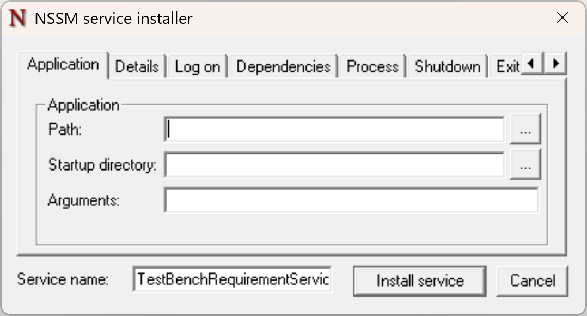

2. Configure the following in the **Application** tab:
   - Path: Path to the service executable
     e.g., `<serviceInstallDir>\.venv\Scripts\<serviceExecutable>`
   - Startup directory: Path to the root directory containing configuration files
     e.g., `<serviceInstallDir>\`
   - Arguments: Startup parameters
     e.g., `start --port <servicePort>`
     
   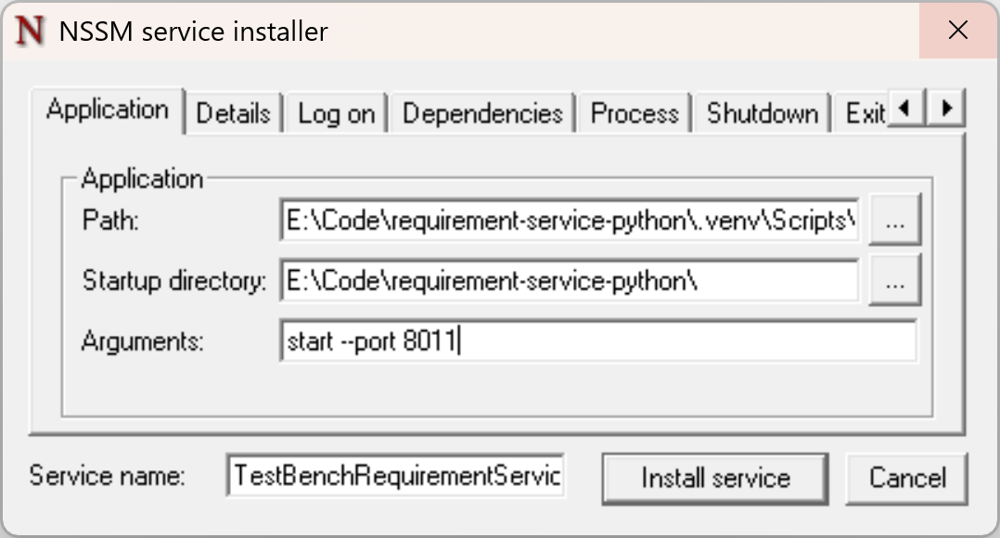

3. Configure the following in the **Details** tab:
   - Display name: `<serviceDisplayName>`
   - Description: `Python-based <serviceDisplayName>`
   - Startup type: `Automatic (Delayed Start)`

   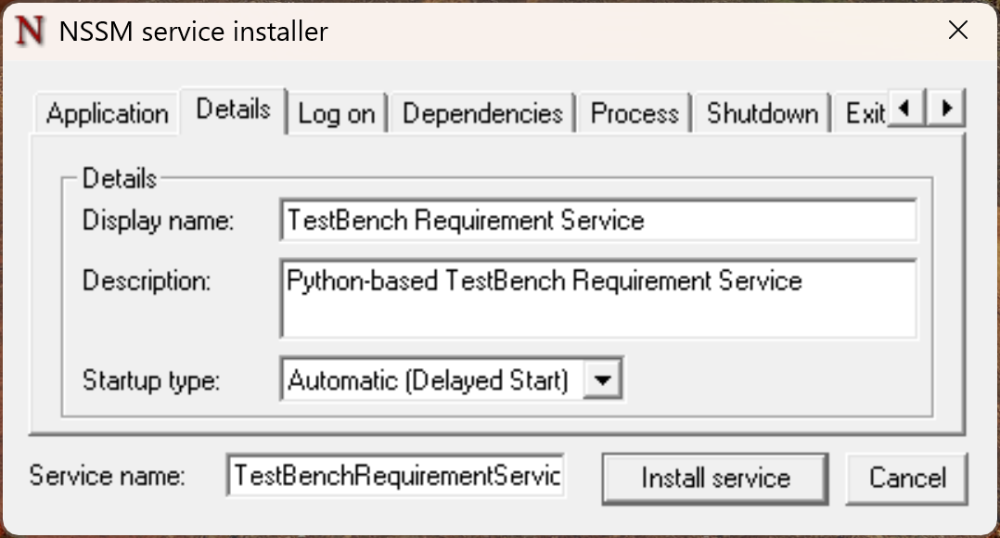

4. **Optional:** In the **Log On** tab, configure the service for specific accounts. Only needed if not using the local system account.

5. **Optional:** In the **Dependencies** tab, configure Windows Service dependencies. Only needed if something must run before the service starts.

6. **Optional:** In the **Process** tab, configure process-related settings such as process priority.

7. **Optional:** In the **Shutdown** tab, specify how the service should handle shutdown.

8. Configure the following in the **Exit actions** tab:
   - Restart: `Stop Service (oneshot mode)`

   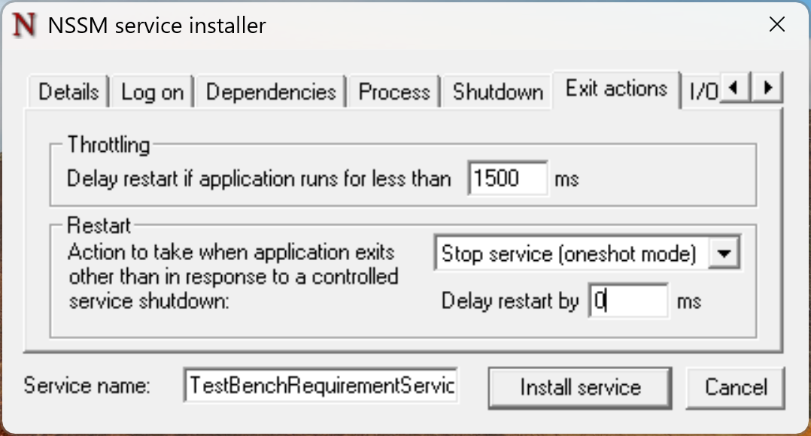

9. Configure the following in the **I/O** tab:
   - Output (stdout): Path to the log file for stdout output
   - Error (stderr): Path to the log file for stderr output

   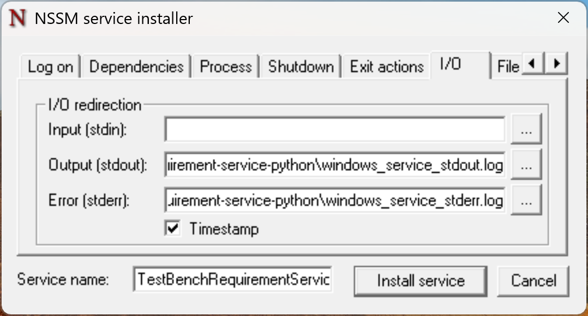

10. **Optional:** In the **File rotation** tab, configure log file rotation.

11. **Optional:** In the **Environment** tab, set environment variables for the service.

12. **Optional:** In the **Hooks** tab, define event hooks such as running a command before service start.

13. After completing all settings, click the "Install Service" button to install the service.<br/><br/>


14. A confirmation dialog should appear upon successful installation.<br/><br/>
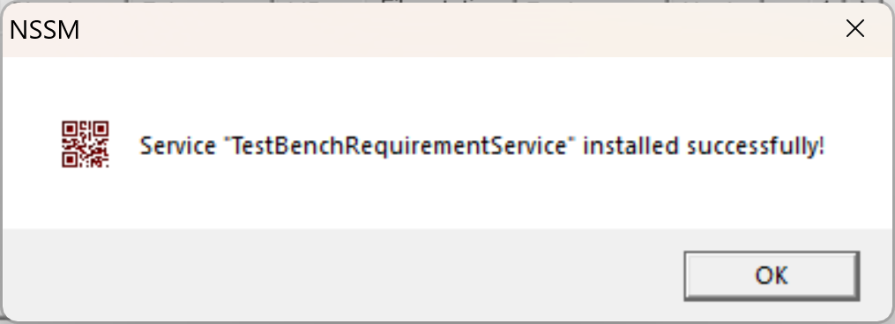

### Method 2: CLI Configuration

1. Install the service directly:
   ```powershell
   nssm install <serviceName> "<serviceInstallDir>\.venv\Scripts\<serviceExecutable>" "start --port <servicePort>"
   ```

2. Configure application settings (startup directory):
   ```powershell
   nssm set <serviceName> AppDirectory "<serviceInstallDir>"
   ```

3. Configure details settings (display name, description, startup type):
   ```powershell
   nssm set <serviceName> DisplayName "<serviceDisplayName>"
   nssm set <serviceName> Description "Python-based <serviceDisplayName>"
   nssm set <serviceName> Start SERVICE_DELAYED_AUTO_START
   ```

4. Configure exit actions (restart behavior):
   ```powershell
   nssm set <serviceName> AppExit Default StopService
   ```

5. Configure I/O settings (logging):
   ```powershell
   nssm set <serviceName> AppStdout "<serviceInstallDir>\logs\stdout.log"
   nssm set <serviceName> AppStderr "<serviceInstallDir>\logs\stderr.log"
   nssm set <serviceName> AppRotateFiles 1
   ```

### Managing the Service

- **Start service**:
   ```powershell
   nssm start <serviceName>
   ```
- **Check status**:
   ```powershell
   nssm status <serviceName>
   ```
- **Edit service**:
   ```powershell
   nssm edit <serviceName>
   ```
- **Restart service**:
   ```powershell
   nssm restart <serviceName>
   ```
- **Stop service**:
   ```powershell
   nssm stop <serviceName>
   ```
- **Remove service**:
   ```powershell
   nssm remove <serviceName>
   ```
<br/>
---

## Option 3: FireDaemon

### Installation Steps

1. Open FireDaemon Pro as Administrator.

   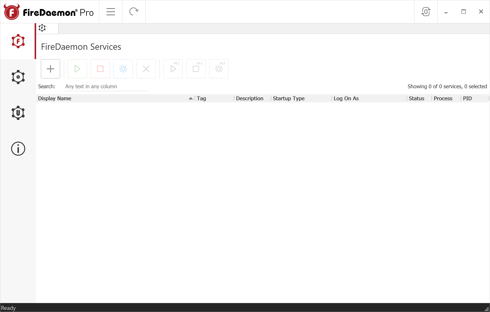

2. Click the Plus icon (New) or press Ctrl+N to create a new service.

   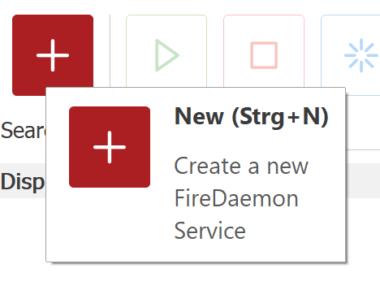
   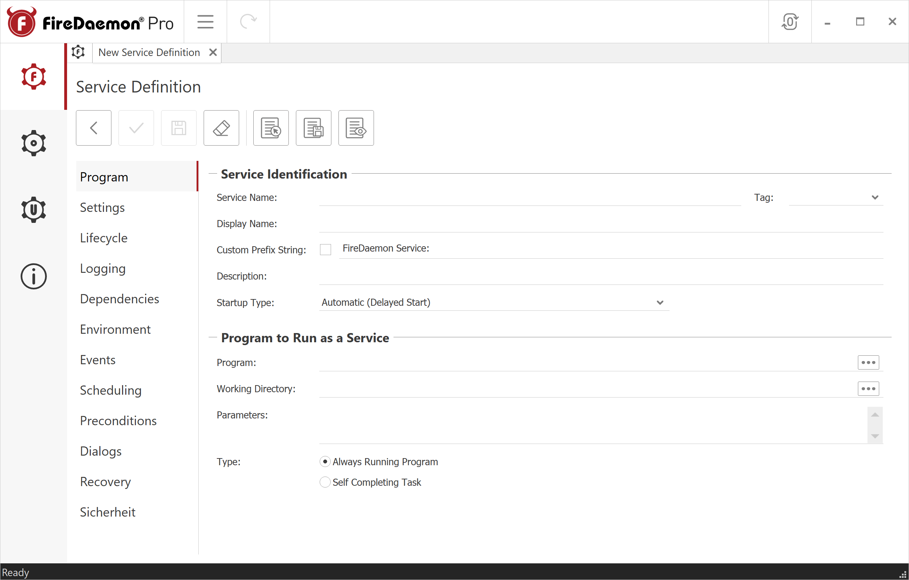

3. Configure the following in the **Program** tab:
   ###### Service Identification:
   - Service Name: `<serviceName>`
   - Display Name: `<serviceDisplayName>`
   - Custom Prefix String: Enable checkbox and leave field empty
   - Description: `Python-based <serviceDisplayName>`
   - Startup Type: `Automatic (Delayed Start)`
   <br/>
   ###### Program to Run as a Service:
   - Program: Path to the service executable
     e.g., `<serviceInstallDir>\.venv\Scripts\<serviceExecutable>`
   - Working Directory: Path to the root directory containing configuration files
     e.g., `<serviceInstallDir>\`
   - Parameters: Startup parameters
     e.g., `start --port <servicePort>`
   - Type: `Always Running Program`
   <br/>
   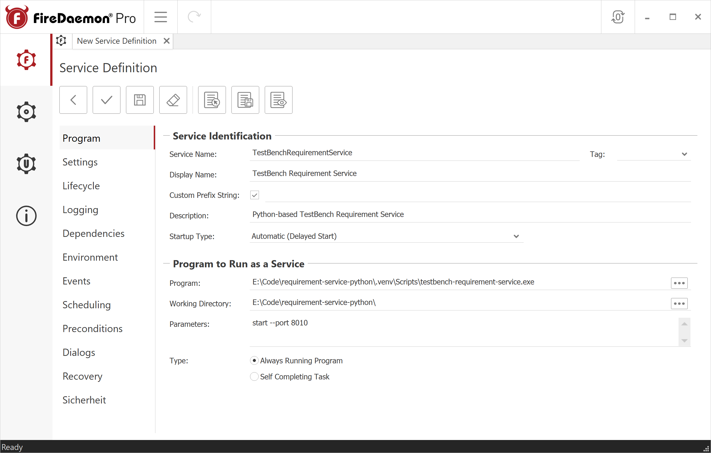

4. Configure the following in the **Settings** tab:
   ###### General:
   - Show Window: `Hidden`
   - Job Type: `Global`
   <br/>
   ###### Logon:
   - Configure if a specific account should run the service.

   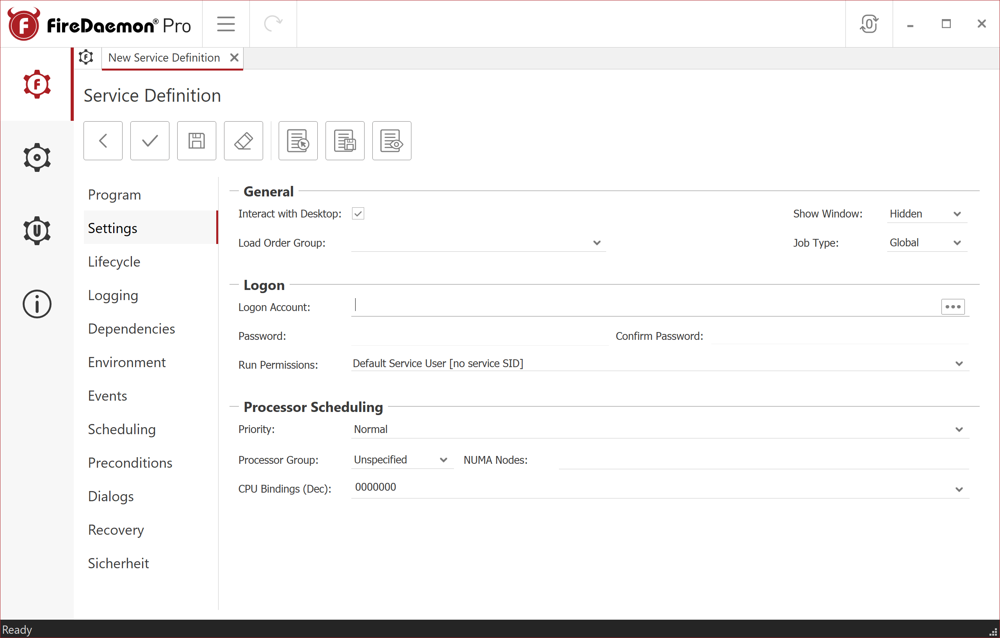

5. Configure the following in the **Lifecycle** tab:
   ###### Lifecycle:
   - Upon Program Exit: `Stop FireDaemon Service`
   - Console Program: `True`
   - Shutdown By: `Ctrl+C` or `Forceful Termination`

   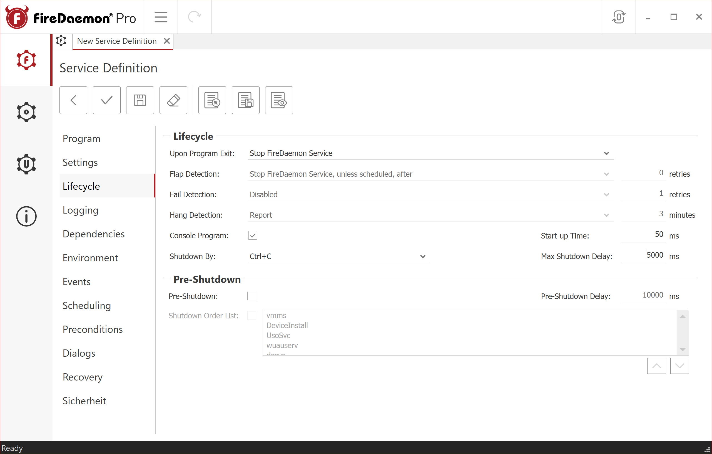

6. Configure the following in the **Logging** tab:
   ###### Output Capture:
   - Capture Stdout in File: Path for stdout logging, e.g., `<serviceInstallDir>\windows_service.log`
   - Capture Stderr in Stdout: `True` or specify a separate path for stderr

   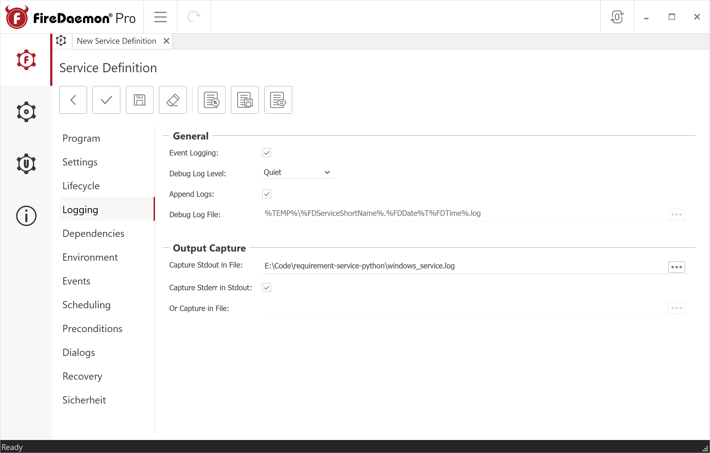

7. **Optional:** In the **Dependencies** tab, configure dependencies to other services.
8. **Optional:** In the **Environment** tab, set environment variables.
9. **Optional:** In the **Events** tab, configure start and termination events.
10. Configure the following in the **Scheduling** tab:
      - Overall Launch Delay: e.g., `60 seconds`

      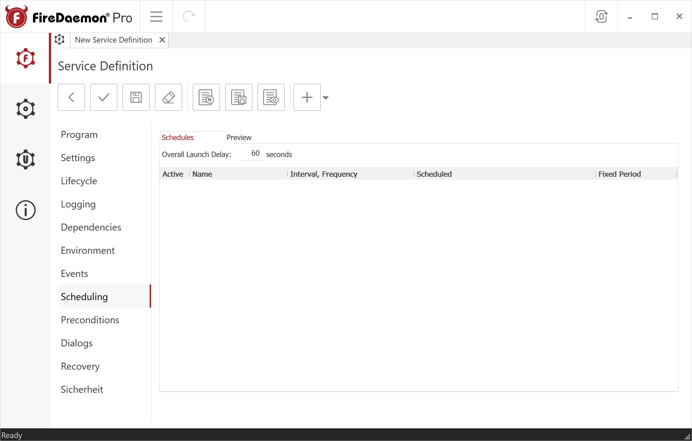

11. Click the checkmark icon to save the settings and close the service definition.<br/><br/>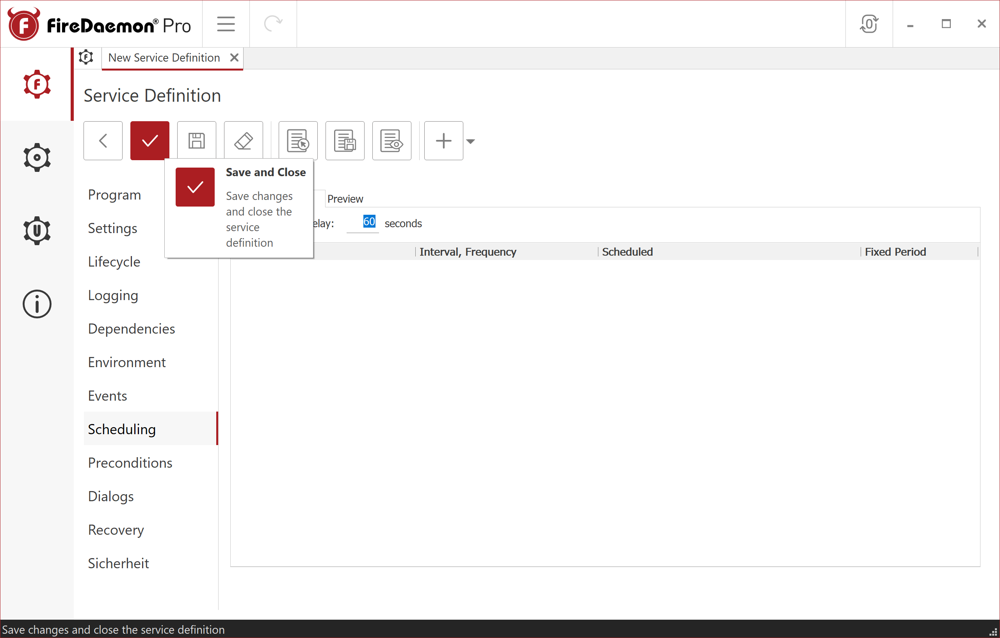

12. Select the service from the services list and click the Start icon (green play button) to start the service.<br/><br/>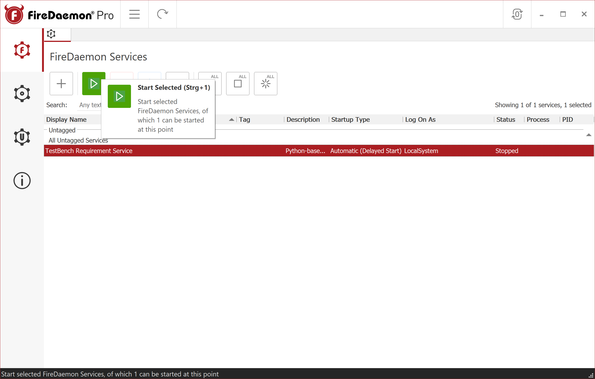

13. The service should now be running.<br/><br/>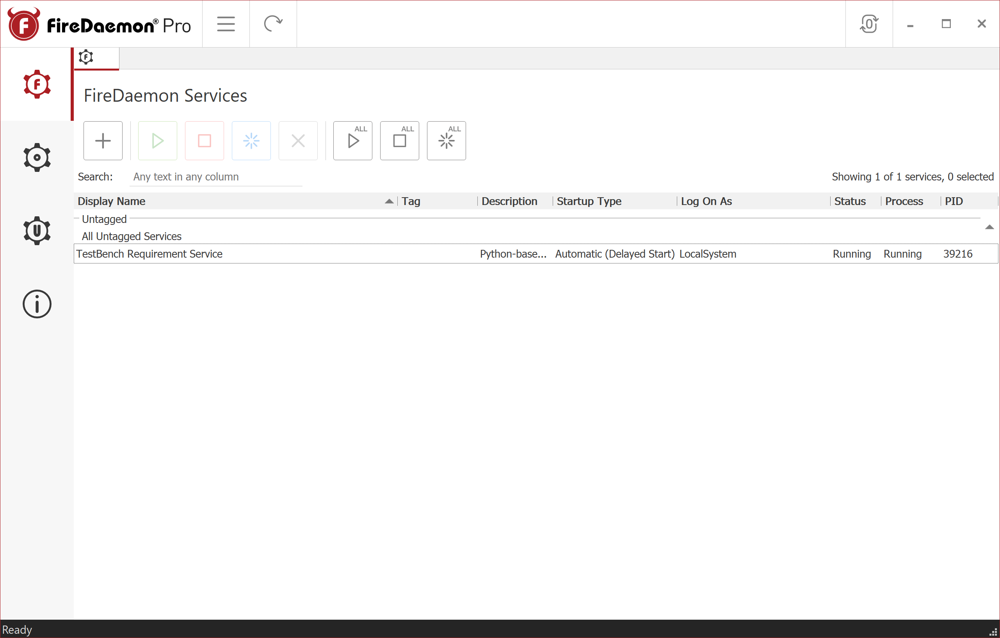

### Managing the Service

First select the service from the services list.

- **Start service**:
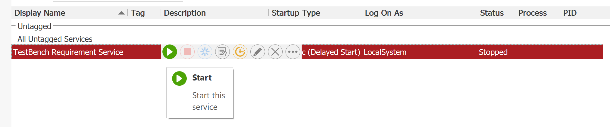

- **Stop service**:
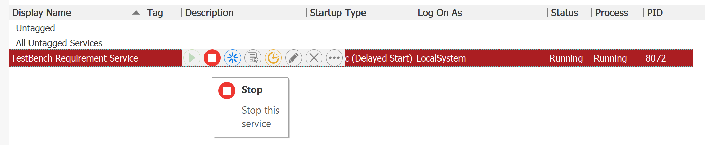

- **Restart service**:
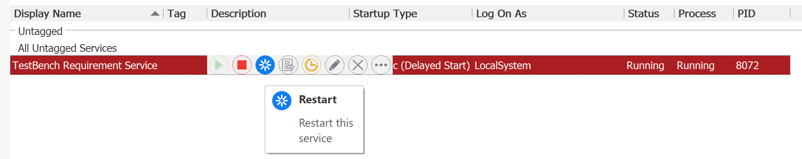

- **Edit service**:
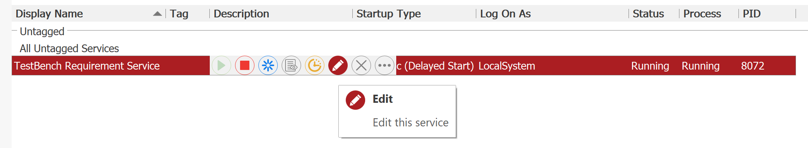

- **Remove service**:
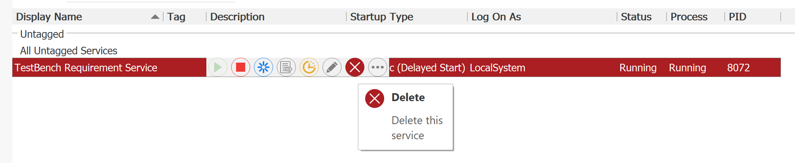
<br/>
---

## Option 4: YAJSW (Yet Another Java Service Wrapper)

### Installation Steps

1. **Requirements:**
   - Java Runtime Environment (JRE) installed
   - Administrator privileges

2. **Extract YAJSW into the service directory:**

   Download YAJSW and extract it into `<serviceInstallDir>\yajsw\`.

   The result should look like:
   ```
   <serviceInstallDir>\
     yajsw\
       bat\
       conf\
       lib\
       ...
   ```

3. **Configure YAJSW:**

   Open `<serviceInstallDir>\yajsw\conf\wrapper.conf` and set the following values:

   ```ini
   # Java executable (adjust path to your Java installation)
   wrapper.java.command=C:/Program Files/Eclipse Adoptium/jdk-21/bin/java.exe

   # Windows Service
   wrapper.ntservice.name=<serviceName>
   wrapper.ntservice.displayname=<serviceDisplayName>
   wrapper.ntservice.description=Python-based <serviceDisplayName>

   # Service paths (forward slashes required by YAJSW)
   wrapper.working.dir=<serviceInstallDir>/
   wrapper.image=<serviceInstallDir>/.venv/Scripts/<serviceExecutable>
   wrapper.app.parameter.1=start
   wrapper.app.parameter.2=--port
   wrapper.app.parameter.3=<servicePort>

   # Logging
   wrapper.logfile=<serviceInstallDir>/logs/yajsw.log
   wrapper.logfile.maxsize=10m
   wrapper.logfile.maxfiles=5
   wrapper.console.pipestreams=true
   ```

   :::note
   Use forward slashes (`/`) in all `wrapper.conf` paths — YAJSW requires this regardless of platform.
   :::

4. **Test the configuration:**
   - Open Command Prompt as Administrator
   - Run: `<serviceInstallDir>\yajsw\bat\runConsole.bat`
   - Verify the service starts without errors, then stop with `Ctrl+C`

5. **Install and start the service:**
   - Open Command Prompt as Administrator
   - Run: `<serviceInstallDir>\yajsw\bat\installService.bat`
   - Run: `<serviceInstallDir>\yajsw\bat\startService.bat`

### Managing the Service

Open Command Prompt as Administrator:

- **Start service**:
   ```cmd
   <serviceInstallDir>\yajsw\bat\startService.bat
   ```
- **Stop service**:
   ```cmd
   <serviceInstallDir>\yajsw\bat\stopService.bat
   ```
- **Remove service**:
   ```cmd
   <serviceInstallDir>\yajsw\bat\uninstallService.bat
   ```
<br/>
---

## Autostart with Windows Task Scheduler *(Alternative)*

The Windows Task Scheduler is a simpler alternative to a registered Windows service. It can launch the service automatically at system startup without installing it as a service.

### Setup

1. Open **Task Scheduler** (search in the Start menu, or Control Panel → Administrative Tools → Task Scheduler).

2. In the left pane, select the **Task Scheduler Library** folder.

3. In the **Actions** pane on the right, click **Create Basic Task...**

4. Enter a **Name** (e.g., `<serviceDisplayName>`) and an optional description → **Next**

5. Select **When the computer starts** → **Next**

6. Select **Start a program** → **Next**

7. Configure the program:
   - **Program/script**: Full path to `<serviceExecutable>`, e.g.:
     - Ready-to-use executable: `<serviceInstallDir>\<serviceExecutable>`
     - Python venv: `<serviceInstallDir>\.venv\Scripts\<serviceExecutable>`
   - **Add arguments**: `start`
   - **Start in (optional)**: The directory containing your `config.toml`, e.g., `<serviceInstallDir>\`

   → **Next**

8. Check **"Open the Properties dialog for this task when I click Finish"** → **Finish**

9. In the **Properties** dialog, configure the following tabs:
   - **General**: Set security options appropriate for your environment — e.g., "Run whether user is logged on or not" and "Run with highest privileges".
   - **Triggers**: Select the existing trigger → **Edit...** → enable **Delay task for** (e.g., `1 minute`) as a startup buffer.
   - **Conditions**: Check that no unwanted conditions are active — for a server machine, uncheck "Start only if on AC power".
   - **Settings**: Uncheck **"Stop the task if it runs longer than:"** — the service is intended to run indefinitely.

:::info
The service can be stopped via Task Manager or `taskkill`. Unlike a registered Windows service there is no clean shutdown handling. For production environments, Servy or NSSM are the recommended approach.
:::
