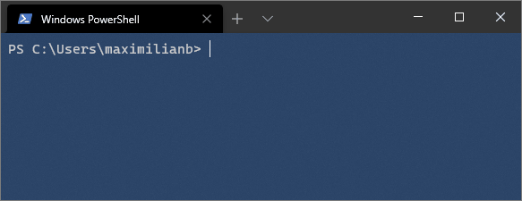
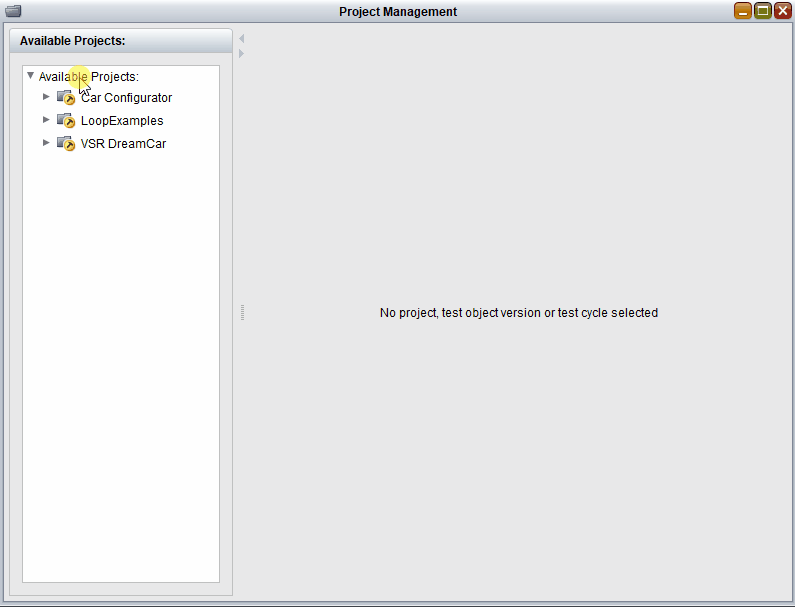
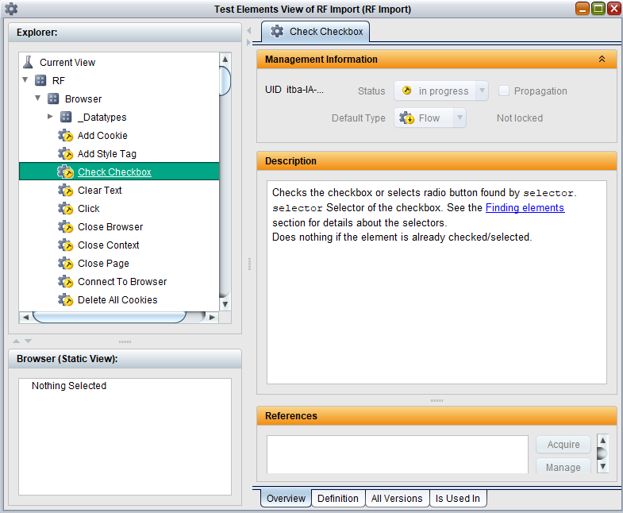

# Quick Start

This guide will help you get started with Libdoc2TestBench quickly.

## Basic Workflow

There are three main use cases for Libdoc2TestBench:

### 1. Import Official Robot Framework Libraries



For the most basic usage, simply pass a Robot Framework library as an argument to the `Libdoc2TestBench` command:

```bash
Libdoc2TestBench BuiltIn
```

This creates a zip file named `BuiltIn.zip` containing the library with all its keywords.

**With custom output name:**
```bash
Libdoc2TestBench Collections MyCollections.zip
```

The `<LIBRARY>` argument corresponds to the Robot Framework library name that you would use to import the library in the `*** Settings ***` section of a robot/resource file.

### 2. Import Custom Robot Framework Libraries and Resource Files

You can specify the path to your Python file or a directory containing multiple libraries:

```bash
Libdoc2TestBench path/to/mykeywords.resource
```

If a directory is given as input, Libdoc2TestBench searches all subdirectories recursively and creates the same subdirectory structure in TestBench:

```bash
Libdoc2TestBench path/to/my_libraries/
```

### 3. Import Multiple Libraries at Once

Create a file with an `*** Import List ***` section:

```robotframework
*** Import List ***
BrowserLibrary
BuiltIn
mycustomlibrary.py
myresource.resource
```

Then import all at once:

```bash
Libdoc2TestBench import_list.libdoc
```

## Importing into TestBench

### Import the Generated Zip File

The generated zip file can be imported via the **Import Project...** menu entry in the Project Management view of TestBench:



### View Imported Elements

Afterwards, you'll find your imported Robot Framework library, the different keywords and the datatypes in the Test Elements view:



The imported test elements can be copied to any other TestBench project.

## Common Options

Here are some frequently used options:

- `--library-root <NAME>` - Defines the subdivision name for libraries (default: `RF`)
- `--resource-root <NAME>` - Defines the subdivision name for resources (default: `Resource`)
- `--created-datatypes <TYPE>` - Specify datatype creation: `ALL`, `ENUMS`, or `NONE` (default: `ENUMS`)
- `-a, --attachment` - Attach resource files to keywords
- `-r, --repository <ID>` - Set repository ID (default: `iTB_RF`)

**Example with options:**
```bash
Libdoc2TestBench BuiltIn --library-root "RobotLibraries" --created-datatypes ALL
```

